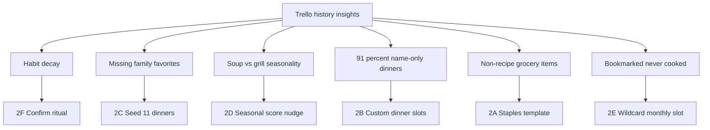

# Meal Prep Roadmap Insights Implementation Plan

> **For agentic workers:** REQUIRED SUB-SKILL: Use superpowers:subagent-driven-development (recommended) or superpowers:executing-plans to implement this plan task-by-task. Steps use checkbox (`- [ ]`) syntax for tracking.

**Goal:** Integrate the six analysis-backed features from [`MEAL_PREP_ROADMAP.md`](../../../../MEAL_PREP_ROADMAP.md) into the live `feature/roadmap-foundation` app (Cloudflare/D1, catalog, scoring, queue, misc groceries)—not the stale root JSON baseline.

**Architecture:** Keep the existing document-store + repository layer. Extend catalog/plan types in place, fold seasonality into the existing scorer, keep staples distinct from per-week misc groceries, introduce discriminated dinner slots for ad-hoc meals, and add a lightweight weekly confirmation ritual. Wildcard infrastructure lands last and waits on human recipe authoring before seeding bookmarks.

**Tech Stack:** Next.js 16.2 App Router, React 19, Vitest, Cloudflare Workers + D1 (or local atomic JSON via `getDocumentStore`), existing brand components under `app/components/brand/`.

**Worktree:** `/Users/harveyschaefer/Downloads/CB/projects/meal-prep/.worktrees/roadmap-foundation`

**Source insights:** [`MEAL_PREP_ROADMAP.md`](../../../../MEAL_PREP_ROADMAP.md) (repo root; untracked handoff doc)

---

## Locked product decisions

These resolve conflicts between the roadmap doc (written for the old app) and the current branch:

| Topic | Decision |
|---|---|
| Target | `.worktrees/roadmap-foundation` only |
| Staples vs misc | **Staples** = reusable household template (settings-level), always merged into store sections when enabled. **Misc** stays per-week freeform under “Miscellaneous”. Both can coexist. |
| Custom meals | Discriminated `DinnerSlot` (`recipe` \| `custom`); never fake catalog IDs |
| Seasonality | Soft score nudge inside `scoreDinnerCandidate`, not a second picker |
| Wildcards vs queue | **Queue** = intentional “cook this soon”. **Wildcard** = untried catalog flag + monthly forced draw. Distinct mechanisms. |
| Confirmation | Means “reviewed / finalized this plan,” not “cooked.” Store `confirmed` + `confirmedAt`. Regenerate resets to unconfirmed. Reminders out of scope. |
| Wildcard content | Build mechanism + empty pool fallback first; author the 5 bookmarks in a later content task before enabling real wildcards |

---

## How insights map to the app



---

## File map (create / modify)

| Area | Files |
|---|---|
| Types | [`lib/types.ts`](../../lib/types.ts) |
| Validation | [`lib/validation.ts`](../../lib/validation.ts), [`lib/recipes/recipeValidation.ts`](../../lib/recipes/recipeValidation.ts) |
| Persistence | [`lib/dataStore.ts`](../../lib/dataStore.ts), new `lib/repositories/staplesRepository.ts`, [`lib/repositories/settingsRepository.ts`](../../lib/repositories/settingsRepository.ts), [`lib/repositories/recipeRepository.ts`](../../lib/repositories/recipeRepository.ts), [`lib/repositories/planRepository.ts`](../../lib/repositories/planRepository.ts) |
| Planning | [`lib/planGenerator.ts`](../../lib/planGenerator.ts), [`lib/planSelection.ts`](../../lib/planSelection.ts), [`lib/planning/scoreRecipe.ts`](../../lib/planning/scoreRecipe.ts), new `lib/planning/seasonality.ts`, new `lib/planning/wildcard.ts` |
| Grocery | [`lib/groceryList.ts`](../../lib/groceryList.ts) |
| API | [`app/api/plan/route.ts`](../../app/api/plan/route.ts), new `app/api/plan/confirm/route.ts`, new `app/api/staples/route.ts`, [`app/api/settings/route.ts`](../../app/api/settings/route.ts) |
| UI | [`app/page.tsx`](../../app/page.tsx), [`app/settings/page.tsx`](../../app/settings/page.tsx), [`app/components/DinnerCard.tsx`](../../app/components/DinnerCard.tsx), [`app/components/GroceryListView.tsx`](../../app/components/GroceryListView.tsx) |
| Seed data | [`data/recipes.json`](../../data/recipes.json) (or catalog write path), new `data/staples.json`, [`data/settings.json`](../../data/settings.json) |
| Tests | matching `lib/**/*.test.ts` files |

---

## Phase 0 — Safety rails (before feature work)

Do not run `npm run db:seed:remote` without a D1 backup. Prefer local verify:

```bash
cd "/Users/harveyschaefer/Downloads/CB/projects/meal-prep/.worktrees/roadmap-foundation"
npm test && npm run lint && npm run build
```

- [ ] **Step 0.1:** Confirm you are in the roadmap-foundation worktree (`git branch --show-current` should be `feature/roadmap-foundation` or equivalent).
- [ ] **Step 0.2:** Run the baseline command above; all existing tests must stay green after each phase.

---

## Phase 1 — 2C Seed missing family dinners

**Why:** 11 historically repeated dishes are absent from the 34-dinner catalog. Pure data upside; no planner changes required once recipes are `active` dinners with `cookMinutes <= 40` (current settings default).

**Files:**
- Modify: `data/recipes.json` (legacy shape) **and/or** add via catalog API / `recipeRepository` so D1 stays consistent
- Modify: `lib/recipes/recipeValidation.test.ts` if needed for new fields later; for this phase keep schema as-is
- Test: add `lib/recipes/seedCoverage.test.ts`

### Dishes to add

| id | name | protein | cookMinutes | seasonCategory (for Phase 5) | suggested ingredients (match existing quantity style) |
|---|---|---|---|---|---|
| `grilled-cheese-tomato-soup` | Grilled Cheese & Tomato Soup | vegetarian | 25 | soup | sandwich bread, sliced cheddar, butter, canned tomato soup, heavy cream |
| `gnocchi-arugula-feta` | Gnocchi with Arugula & Feta | vegetarian | 25 | pasta | potato gnocchi, arugula, feta, lemon, olive oil |
| `eamon-bec-gnocchi-soup` | Eamon & Bec Gnocchi Soup | pork | 35 | soup | potato gnocchi, broth, kale/spinach, italian sausage, parmesan |
| `kielbasa-soup` | Kielbasa Soup | pork | 35 | soup | kielbasa, potatoes, cabbage/kale, chicken broth, smoked paprika |
| `lemon-butter-chicken-orzo` | Lemon Butter Chicken & Orzo | chicken | 35 | pasta | chicken breast, orzo, lemon, butter, parmesan, spinach |
| `tamales` | Tamales | pork | 40 | none | masa, pork/chicken filling, corn husks, sauce *(or mark weekend if over 40)* |
| `dumplings` | Dumplings | pork | 35 | none | ground pork, wonton wrappers, ginger, scallion, soy, sesame oil |
| `brats-corn` | Brats & Corn on the Cob | pork | 30 | grill | bratwurst, buns, corn, butter |
| `adobo-cauliflower` | Adobo Cauliflower | vegetarian | 35 | none | cauliflower, soy, vinegar, garlic, bay leaf |
| `taco-cups` | Taco Cups | beef | 30 | tacos | wonton/tortilla cups, ground beef, taco seasoning, cheese, salsa |
| `udon` | Udon | egg | 30 | none | udon, dashi/broth, soy, mirin, scallion, soft-boiled egg |

Use kebab-case ids. Style ingredients like existing entries (`"1 lb ground pork"`, not bare `"ground pork"`). Set `tags` including `"favorite"` where historically frequent; set `effortScore`/`noveltyScore` reasonably (most familiar → effort 2–3, novelty 1–2).

- [ ] **Step 1.1: Write failing coverage test**

```ts
// lib/recipes/seedCoverage.test.ts
import { describe, expect, it } from "vitest";
import { readFileSync } from "fs";
import path from "path";

const REQUIRED_IDS = [
  "grilled-cheese-tomato-soup",
  "gnocchi-arugula-feta",
  "eamon-bec-gnocchi-soup",
  "kielbasa-soup",
  "lemon-butter-chicken-orzo",
  "tamales",
  "dumplings",
  "brats-corn",
  "adobo-cauliflower",
  "taco-cups",
  "udon",
];

describe("family favorite seed coverage", () => {
  it("includes all historically missing dinners", () => {
    const raw = JSON.parse(
      readFileSync(path.join(process.cwd(), "data/recipes.json"), "utf-8")
    );
    const dinners = raw.dinners ?? raw.recipes?.filter((r: { kind: string }) => r.kind === "dinner");
    const ids = new Set(dinners.map((d: { id: string }) => d.id));
    for (const id of REQUIRED_IDS) {
      expect(ids.has(id), `missing ${id}`).toBe(true);
    }
  });
});
```

- [ ] **Step 1.2:** Run `npm test -- lib/recipes/seedCoverage.test.ts` — expect FAIL.
- [ ] **Step 1.3:** Add the 11 dinners to `data/recipes.json` matching existing entry shape. If the live store has already been upgraded to catalog schema v2, also upsert via the recipe repository / local seed path so runtime catalog includes them.
- [ ] **Step 1.4:** Re-run test — expect PASS. Spot-check: `cookMinutes <= 40` for all except intentional weekend dishes; if `tamales` must exceed 40, either keep at 40 or accept it only appears when settings allow.
- [ ] **Step 1.5:** Commit: `feat: seed eleven historically missing family dinners`

---

## Phase 2 — 2A Household staples

**Why:** Historical grocery lists included milk/eggs/bread/snack produce not tied to recipes. Misc grocery already covers one-off weekly adds; staples cover the recurring baseline.

**Model:**

```ts
// lib/types.ts additions
export type GrocerySectionName =
  | "Produce"
  | "Meat & Seafood"
  | "Dairy & Eggs"
  | "Bakery & Bread"
  | "Frozen"
  | "Pantry & Dry Goods"
  | "Other";

export type StapleItem = {
  id: string;
  name: string;
  section: GrocerySectionName;
};

export type StaplesData = {
  items: StapleItem[];
};

// Settings additions
includeStaplesInGroceryList: boolean; // default true
```

**Files:**
- Create: `data/staples.json`, `lib/repositories/staplesRepository.ts`, `app/api/staples/route.ts`
- Modify: `lib/types.ts`, `lib/validation.ts`, `lib/groceryList.ts`, `lib/repositories/settingsRepository.ts`, `app/settings/page.tsx`, `app/api/plan/route.ts` (grocery build needs staples + settings), `lib/groceryList.test.ts`

- [ ] **Step 2.1: Failing grocery test — staples merge into sections**

```ts
it("merges staples into store sections when enabled", () => {
  const sections = buildGroceryList(planFixture(), {
    includeStaples: true,
    staples: [{ id: "s1", name: "Milk", section: "Dairy & Eggs" }],
  });
  const dairy = sections.find((s) => s.section === "Dairy & Eggs");
  expect(dairy?.items.some((i) => i.name === "Milk")).toBe(true);
  expect(sections.find((s) => s.section === "Miscellaneous")?.items.some((i) => i.name === "Milk")).toBeFalsy();
});

it("omits staples when disabled without dropping misc", () => {
  const sections = buildGroceryList(
    planFixture({
      miscGrocery: [{ id: "m1", name: "Paper towels", addedAt: "2026-07-19T00:00:00.000Z" }],
    }),
    { includeStaples: false, staples: [{ id: "s1", name: "Milk", section: "Dairy & Eggs" }] }
  );
  expect(sections.flatMap((s) => s.items).some((i) => i.name === "Milk")).toBe(false);
  expect(sections.find((s) => s.section === "Miscellaneous")?.items[0]?.name).toBe("Paper towels");
});
```

- [ ] **Step 2.2:** Change `buildGroceryList` signature to accept optional staples context; when a staple name collides with a recipe ingredient core name, merge entries (source: `"Household staple"`). Use explicit `section` — do **not** re-run `categorize()` on staples.
- [ ] **Step 2.3:** Implement `staplesRepository` (`getStaples` / `saveStaples`) via `getDocumentStore()` reading `staples.json`. Seed defaults: milk, eggs, sandwich bread, butter, bananas (or household-realistic set) with correct sections.
- [ ] **Step 2.4:** Extend `Settings` + `parseSettings` + `withDefaults` for `includeStaplesInGroceryList: true`.
- [ ] **Step 2.5:** `GET/PUT /api/staples` for list edits; settings page: toggle + simple editable list (name + section select).
- [ ] **Step 2.6:** Wire plan GET/POST grocery build to load settings + staples.
- [ ] **Step 2.7:** Tests pass. Commit: `feat: add household staples to grocery lists`

---

## Phase 3 — 2F Weekly confirm ritual

**Why:** Biggest insight — planning habit decayed from ~40 weeks/year to 12. Auto-generation removes effort but not the habit of looking at the plan.

**Model:**

```ts
export type WeekPlan = {
  // ...existing fields
  confirmed?: boolean;      // default false for legacy rows
  confirmedAt?: string;     // ISO timestamp when confirmed
};
```

**Behavior:**
- Confirm action sets `confirmed: true`, `confirmedAt: now`.
- `ensure` of existing plan does not change confirmation.
- `regenerate` always writes `confirmed: false` and clears `confirmedAt`.
- UI: small status pill (“Confirmed” / “Not confirmed”) + “Confirm this week” button. Do not confuse with the existing regenerate confirmation dialog (`confirmRegen`).

**Files:**
- Modify: `lib/types.ts`, `lib/planGenerator.ts`, `app/api/plan/route.ts`
- Create: `app/api/plan/confirm/route.ts` (or `action: "confirm"` on existing POST — prefer dedicated route for clarity)
- Modify: `app/page.tsx`
- Test: `lib/planGenerator.confirm.test.ts` (mock repositories) **or** pure helper tests if confirm logic is extracted

- [ ] **Step 3.1:** Extract `withConfirmationDefaults(plan)` and `markPlanConfirmed(plan, at)` / `clearConfirmation(plan)` helpers; unit test defaults for legacy plans missing the field.
- [ ] **Step 3.2:** In `buildPlan`, always set `confirmed: false`, omit/clear `confirmedAt` (preserve `miscGrocery` as today).
- [ ] **Step 3.3:** Add confirm mutation that loads current week, sets fields, `upsertWeekPlan`, returns resolved plan + grocery.
- [ ] **Step 3.4:** Home UI: pill + button; disable confirm when already confirmed; show `confirmedAt` lightly if present.
- [ ] **Step 3.5:** Manual check: confirm → reload persists; regenerate → pill returns to unconfirmed.
- [ ] **Step 3.6:** Commit: `feat: add weekly plan confirmation ritual`

---

## Phase 4 — 2B Ad hoc / custom dinner slots

**Why:** 91% of historical dinners were name-only. Requiring full catalog entries blocks Trello-like flexibility.

**Model (breaking change — migrate carefully):**

```ts
export type CustomDinner = {
  id: string; // opaque slot id, e.g. `custom:<uuid>` — NOT a catalog id
  name: string;
  ingredients: string[];
  cookMinutes?: number;
  protein?: string;
};

export type DinnerSlot =
  | { type: "recipe"; recipeId: string }
  | { type: "custom"; custom: CustomDinner };

// WeekPlan.dinners becomes DinnerSlot[]
// Locks.dinners stays (string | null)[] where string is recipeId OR custom.id
```

**Resolution rules:**
- `resolvePlan`: recipe slots look up catalog; custom slots become synthetic `Dinner` objects (`protein: custom.protein ?? "varies"`, `cookMinutes: custom.cookMinutes ?? 0`, `tags: ["custom"]`).
- `recentDinnerIds`: only collect `type === "recipe"` recipeIds — customs never enter avoid-set.
- Grocery: custom ingredients included when present; empty ingredients contribute nothing (like leftovers).
- Customs never written to recipe catalog.

**API / UI:**
- New plan action `setCustomDinner`: `{ index, name, ingredients? }` → locks that slot, stores custom slot, rebuilds grocery.
- `DinnerCard` (or wrapper on home): “Type your own” inline form; saving locks the slot.

**Files:**
- Modify: `lib/types.ts`, `lib/planGenerator.ts`, `lib/planSelection.ts` (accept locked recipe ids only for empty-slot fill; locked custom slots already filled), `lib/validation.ts`, `lib/groceryList.ts`, `app/api/plan/route.ts`, `app/page.tsx`, `app/components/DinnerCard.tsx`
- Migration: when reading history, if `dinners[i]` is a string, coerce to `{ type: "recipe", recipeId }` in `planRepository` or `resolvePlan` ingress.

- [ ] **Step 4.1:** Write tests for coercion helper + `recentDinnerIds` ignoring customs + grocery including custom ingredients.
- [ ] **Step 4.2:** Implement coercion + type updates end-to-end until `npm test` is green.
- [ ] **Step 4.3:** Add `setCustomDinner` API path and home UI.
- [ ] **Step 4.4:** Acceptance: custom locked survives regenerate of other slots; no catalog pollution; avoid-set unaffected.
- [ ] **Step 4.5:** Commit: `feat: support ad hoc custom dinner slots`

---

## Phase 5 — 2D Seasonal weighting

**Why:** Soup peaks in fall/winter; grill peaks in spring/summer. Current scorer only uses effort/novelty/recent.

**Approach:** Add optional `seasonCategory?: "soup" | "grill" | "tacos" | "pasta" | "none"` on `CatalogRecipe` / `Dinner`. Encode monthly multipliers from the roadmap table as a soft score adjustment (lower score = more likely).

```ts
// lib/planning/seasonality.ts
export type SeasonCategory = "soup" | "grill" | "tacos" | "pasta";

/** Soft penalty/bonus added to scoreDinnerCandidate (lower is better). */
export function seasonScoreAdjustment(
  category: SeasonCategory | "none" | undefined,
  monthIndex: number // 0–11
): number {
  // Derived from Part 1 monthly counts: peak months get ~ -0.6, trough ~ +0.4
  // Exact curve is judgment; keep |adjustment| <= 0.75 so it never overrides
  // protein diversity or a 2.5 recent penalty.
}
```

Wire into `scoreDinnerCandidate(..., monthIndex)` from `buildPlan` via `new Date(weekOf + "T12:00:00")` (or local household assumption: America/New_York — document in code comment).

**Tagging pass:** Set `seasonCategory` on existing + new dinners (soups → soup, carne/fajitas/brats → grill, tacos/taco-cups → tacos, pasta/orzo/gnocchi-pasta dishes → pasta). Omit or `none` otherwise.

- [ ] **Step 5.1:** Unit tests: November soup adjustment < June soup; grill opposite; `none` always 0; magnitude capped.
- [ ] **Step 5.2:** Implement `seasonality.ts` + scorer integration + catalog field in validation.
- [ ] **Step 5.3:** Tag recipes in data (batch edit).
- [ ] **Step 5.4:** Optional deterministic integration test with mocked RNG/`rankDinners` inputs proving soup ranks above grill in November among equal effort/novelty peers.
- [ ] **Step 5.5:** Commit: `feat: soft seasonal weighting in dinner scoring`

---

## Phase 6 — 2E Wildcard monthly slot (mechanism first)

**Why:** Bookmarks never cooked; generator only reinforces rotation. Queue is intentional; wildcard is “force one untried.”

**Model:**

```ts
// on CatalogRecipe / Dinner
wildcard?: boolean; // true = eligible for monthly wildcard draw
```

**Cadence (pick simplest):** First plan **ensured** in a new calendar month gets one wildcard slot. Track with settings or a tiny `data/wildcard-state.json`:

```ts
type WildcardState = { lastWildcardMonth: string | null }; // "2026-07"
```

**Selection rules:**
1. If month already had a wildcard → normal pick.
2. If wildcard pool empty → normal pick (no error).
3. Else: choose one empty dinner slot; draw from `wildcard === true` active dinners (bypass recent avoid); other slots normal.
4. After selection: set that recipe’s `wildcard: false` (graduates into normal rotation) via recipe repository update.
5. Queue priority still fills first; if queue already filled all slots, skip wildcard that week (document this edge case). Prefer: reserve slot 0 for wildcard when eligible before queue fill, **or** apply wildcard to first empty slot after queue — choose **after queue**, document in code.

**Content gate:** Do not scrape/author Momofuku/Vice/NYT bookmarks in this phase. Leave pool empty or add 0–1 placeholder only if needed for tests. Separate follow-up content task after human writes recipes.

- [ ] **Step 6.1:** Tests for: eligible month draws one wildcard; empty pool no-ops; graduation clears flag; ineligible month no draw.
- [ ] **Step 6.2:** Implement `lib/planning/wildcard.ts` + `buildPlan` integration + recipe flag persistence.
- [ ] **Step 6.3:** Catalog UI: optional “Wildcard / untried” checkbox on recipe form (so future authored recipes can enter the pool).
- [ ] **Step 6.4:** Commit: `feat: monthly wildcard dinner slot mechanism`
- [ ] **Step 6.5 (later content):** Author 5 bookmark recipes with ingredients/instructions, set `wildcard: true`, link `source.url`.

---

## Testing matrix (per phase)

| Phase | Must pass |
|---|---|
| Any | `npm test` |
| Any | `npm run lint` (in worktree; avoid root lint polluted by nested junk) |
| Before merge/deploy | `npm run build` |
| Cloudflare path | `npm run cf-build` when touching edge/proxy-sensitive code |
| Manual | Home plan → grocery → settings toggle → confirm → regenerate |

---

## Out of scope (explicit)

- Sunday push reminders / email / cron (needs hosting notification story)
- Replacing misc groceries with staples
- Reproducible Trello re-analysis pipeline
- Postgres schema revival (`postgres.schema.sql` stays unused)
- Remote D1 reseed without backup
- Auth model changes

---

## Suggested execution order (matches roadmap + branch reality)

1. Phase 1 — seed dishes  
2. Phase 2 — staples  
3. Phase 3 — confirm ritual  
4. Phase 4 — custom dinners  
5. Phase 5 — seasonal scoring  
6. Phase 6 — wildcard mechanism → then content authoring  

Each phase should leave the app shippable.

---

## Self-review checklist

- [x] Spec coverage: 2A–2F each have a phase; Part 1 insights cited via decisions table  
- [x] No placeholders for core behavior; wildcard *content* explicitly deferred  
- [x] Types consistent: `DinnerSlot`, `StapleItem`, `seasonCategory`, `wildcard`, confirmation fields  
- [x] Conflicts with scoring/queue/misc resolved in locked decisions  

---

## Execution handoff

Plan saved to:

`/.worktrees/roadmap-foundation/docs/superpowers/plans/2026-07-19-meal-prep-roadmap-insights.md`

**Two execution options:**

1. **Subagent-Driven (recommended)** — fresh subagent per phase/task, review between tasks  
2. **Inline Execution** — execute phases in this session with checkpoints  

Which approach?
